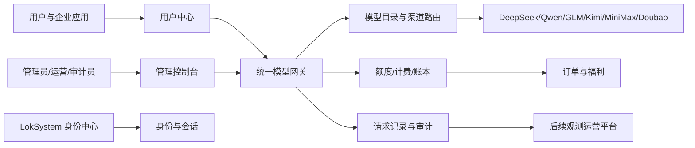
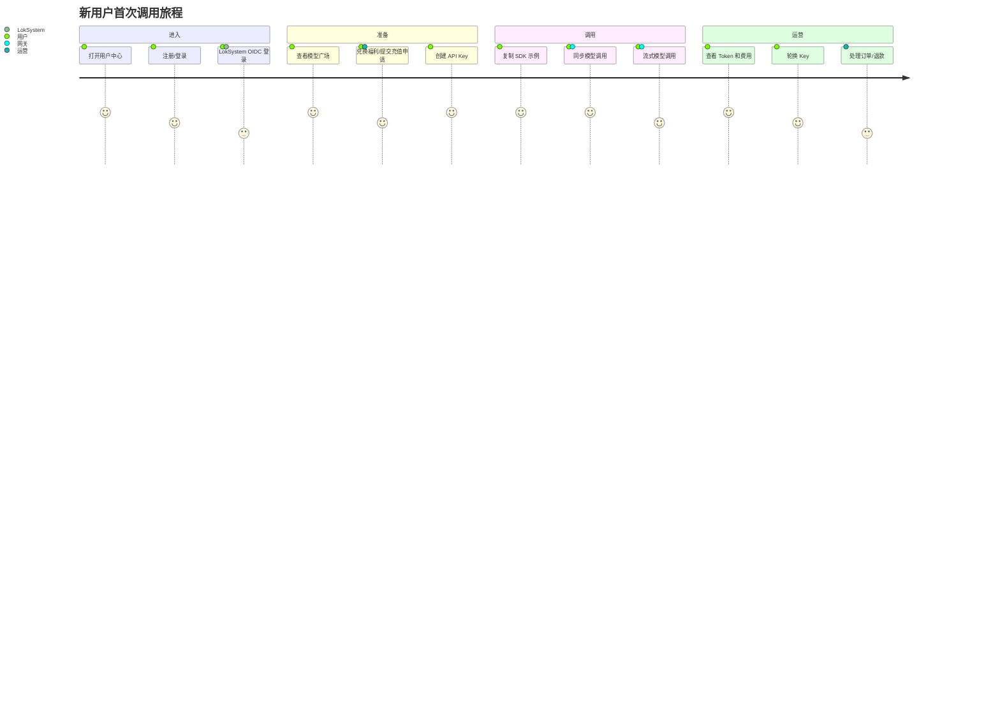

# LokToken 产品能力地图

版本：v1.0
定位：用于产品规划、研发拆解、商用验收和发布决策

## 1. 一句话定位

LokToken 是 LokSystem 生态及独立用户使用的统一模型服务与额度运营平台：上游连接多个模型供应商，下游提供模型广场、统一 API、账户额度、API Key、请求记录和运营治理。



## 2. 能力状态图例

| 状态 | 含义 |
|---|---|
| A 已实现并验证 | 代码、接口或浏览器 UAT 已验证，可进入预发布复核 |
| B 已实现待外部配置 | 平台能力已具备，但依赖真实密钥、域名、OIDC、支付或部署环境 |
| C 候选/待适配 | 已有模型目录或页面入口，但不应作为生产可调用能力 |
| D 规划能力 | 产品边界已确定，尚未纳入当前发布范围 |

## 3. 六层产品能力地图

### L1 基础运行与数据底座

| 能力 | 状态 | 说明 | 商用门槛 |
|---|---|---|---|
| API 服务与健康检查 | A | `/healthz`、`/readyz`、OpenAPI | 健康、就绪、错误响应稳定 |
| PostgreSQL 生产同构 | A | Compose、Alembic、冷重启和备份恢复 Gate | 预发布迁移、备份恢复、回滚通过 |
| SQLite 开发环境 | A | 本地开发和快速 UAT | 不得作为生产数据库 |
| Docker/Nginx 部署 | B | 已提供 Compose 和 Nginx 示例 | HTTPS、域名、资源、日志和备份到位 |
| 配置与密钥治理 | B | 环境变量、供应商密钥加密保存 | 密钥不进 Git、日志和浏览器 |
| 限流与资源保护 | B | 服务内滑动窗口限流 | 公网网关/WAF 使用共享限流 |

### L2 身份、账号与权限

| 能力 | 状态 | 面向对象 | 商用门槛 |
|---|---|---|---|
| 管理员账号 | A | 超级管理员、运营、审计员 | 首次初始化一次性、密码策略、停用和审计 |
| 管理员会话治理 | A | 管理端 | 登出、停用、会话版本失效 |
| 用户注册/登录 | A | 独立用户 | 错误提示、限流、退出和会话失效 |
| 密码重置 | A/B | 用户 | 预发布安全 Webhook；生产不回显重置凭证 |
| 安全联系方式绑定 | A/B | 用户 | 当前密码确认、通知送达和事件记录 |
| LokSystem 本机 SSO | A | 桌面联调 | 只用于本机联调，不用于生产统一登录 |
| LokSystem OIDC | B | LokSystem 用户 | HTTPS issuer、PKCE、稳定 `lok_user_id`、绑定策略 |
| 团队空间与项目 | A/B | 企业团队 | 成员角色、项目额度和资源边界需预发布验证 |
| 角色权限矩阵 | A | 管理端 | 页面隐藏与 API 强制校验同时生效 |

### L3 模型目录与统一调用

| 能力 | 状态 | 说明 | 商用门槛 |
|---|---|---|---|
| 模型目录 | A | 公开模型 ID、类型、能力、上下文和价格 | 目录与真实渠道一一对应 |
| 模型广场 | A | 用户查看可用模型并复制调用示例 | 只显示已上架且健康的模型 |
| 模型类型筛选 | A | 文本、图像、视频、语音等 | 类型、适配器和计费规则不可混淆 |
| 单模型接入 | A/B | 公开模型 + 上游模型 + Primary 渠道 | 密钥、价格、健康检查和预检通过 |
| 批量模型接入 | A/B | 读取 OpenAI-compatible `/models` | 不自动发布，逐模型核价和预检 |
| 多渠道路由 | A/B | 优先级、权重、主备渠道 | 真实主备切换、重试和熔断通过 |
| 渠道健康检查 | A/B | 单渠道或全渠道 `/models` 检查 | 密钥错误、限流、超时状态可解释 |
| 文本/聊天调用 | A | `/v1/chat/completions` | 至少一个真实供应商完成 UAT |
| SSE 流式调用 | A | OpenAI-compatible stream | 首字节后不重放，断流可追踪 |
| 图像生成 | C | 已有候选模型目录 | 完成 `/v1/images/generations` 适配和计费 |
| 视频生成 | C | 已有候选模型目录 | 完成异步任务、状态查询和按任务计费 |
| 语音能力 | C | 类型筛选已预留 | 完成 ASR/TTS 接口和供应商验证 |

### L4 额度、计费与财务闭环

| 能力 | 状态 | 说明 | 商用门槛 |
|---|---|---|---|
| 账户余额 | A | 微元精度，账户共享给多个 Key | 余额不可为负，所有变动有流水 |
| 请求预扣/结算 | A | 先预扣，按真实 usage 结算并退差额 | 同步、流式、失败和重试均对账 |
| Token 统计 | A/B | 输入、输出、总 Token | 与供应商原始 usage 逐笔核验 |
| 平台售价 | A/B | 元/1M Token 展示，内部微元/1K | 供应商成本、平台售价和毛利可追溯 |
| 余额不足 | A | 返回 402/`insufficient_balance` | 不产生负余额和悬挂预扣 |
| 失败退款 | A | 超时、供应商失败释放预扣 | 失败、重试、流式中断均有证据 |
| 重复请求幂等 | A/B | 请求/订单/充值幂等 | 相同幂等键不得重复扣费或入账 |
| 账户流水 | A | 充值、消费、退款、福利独立记录 | 余额、订单、usage、流水可对账 |
| 人工充值确认 | A | 当前联调和运营流程 | 仅预发布/授权运营使用 |
| 真实在线支付 | D | 微信/支付宝等支付适配器 | 沙箱验签、回调幂等、退款和财务对账 |
| 退款 | A/B | 当前人工/接口状态机 | 真实支付接入后按支付渠道原路退款 |
| 供应商账单核验 | B | 已有 DeepSeek 核验流程 | 全供应商逐笔导入、差异告警和月结 |

### L5 运营、治理与安全

| 能力 | 状态 | 说明 | 商用门槛 |
|---|---|---|---|
| 管理概览 | A | 余额、请求、Token、消费、最近调用 | 指标与明细可追溯 |
| 账户管理 | A | 创建、停用、身份映射、额度操作 | 操作原因、幂等和审计完整 |
| API Key 管理 | A | 创建、脱敏、停用、轮换、限额 | 完整 Key 只展示一次，泄露可快速止损 |
| 订单管理 | A | 待处理、已入账、已拒绝、已退款 | 状态机和运营权限强制执行 |
| 福利管理 | A | 创建、过期、次数限制、兑换历史 | 明文只展示一次，哈希保存 |
| 用量管理 | A | 账户、模型、Key、状态、时间筛选 | 导出隔离、脱敏和数据留存策略 |
| 安全审计 | A | 管理和门户关键动作 | 不记录密钥、兑换码和模型正文 |
| 安全通知 | B | 密码、Key、会话等通知 | Webhook 签名、重试和告警 |
| 运营告警 | D | 余额、渠道、失败率、成本异常 | 需要告警规则和通知渠道 |
| 观测运营平台 | D | LangSmith/Langfuse 类 trace/metrics | TOKEN 稳定后独立建设，不与计费耦合 |

### L6 用户体验与生态接入

| 能力 | 状态 | 用户价值 | 商用门槛 |
|---|---|---|---|
| 管理控制台导航 | A | 管理概览、模型、账户、API、订单、福利、用量、审计 | 角色菜单和按钮状态一致 |
| 用户中心导航 | A | 概览、广场、额度、API、请求、订单、福利 | 新用户路径无断点 |
| 桌面响应式布局 | A | 1440x1000 DOM/交互检查通过 | 预发布截图归档 |
| 移动响应式布局 | A | 390x844 DOM/交互检查通过 | 预发布截图归档 |
| API 文档/调用示例 | A | cURL、Python、OpenAPI | 示例与真实可用模型一致 |
| LokSystem 统一入口 | B | 从 LokSystem 直接进入 Token | 生产 OIDC 和账号绑定通过 |
| 独立 LokToken 入口 | A | 不依赖 LokSystem 也可使用 | 注册、额度、Key 和调用闭环通过 |
| 企业团队 | B | 多成员共享空间和项目隔离 | 成员权限、项目额度和审计通过 |
| 渠道分发 | D | 合作伙伴或渠道销售 Token | 分账、配额、子账户和风控设计完成 |

## 4. 用户侧能力地图



## 5. 管理侧能力地图

| 管理模块 | 核心对象 | 典型操作 | 关键输出 |
|---|---|---|---|
| 管理概览 | 平台指标 | 刷新、查看最近调用 | 余额、请求、Token、消费 |
| 模型管理 | 模型、渠道、价格 | 批量接入、核价、健康检查、预检、上架 | 可调用模型目录 |
| 账户管理 | LokSystem/独立账户 | 创建、停用、发放额度、试用链接 | 账户和余额 |
| API 管理 | API Key | 创建、停用、轮换、限额 | 可撤销调用凭证 |
| 订单管理 | 充值订单 | 确认、拒绝、退款、对账 | 订单状态和账本流水 |
| 福利管理 | 兑换码 | 创建、过期、次数限制 | 试用/活动额度 |
| 用量管理 | 请求记录 | 筛选、分析、导出 | 成本、用量和异常 |
| 安全审计 | 审计事件 | 查看、按对象追溯 | 合规和责任证据 |

## 6. 核心业务闭环

### 6.1 模型上架闭环

```text
供应商目录
  -> 创建公开模型
  -> 配置上游地址/模型/密钥引用
  -> 配置平台输入输出价格
  -> 配置 Primary/备用渠道
  -> 健康检查
  -> 真实预检
  -> 启用并上架
  -> 用户模型广场可见
```

阻断规则：缺密钥、无健康渠道、价格为 0、适配器不支持、真实预检失败时，不得上架。

### 6.2 请求计费闭环

```text
API Key 鉴权
  -> 检查账户余额/Key 限额
  -> 预扣额度
  -> 选择渠道并调用上游
  -> 读取 usage
  -> 按实际 Token 结算
  -> 退回预扣差额
  -> 写请求记录、账本和审计
```

异常分支：

- 上游在首字节前失败：按策略切换渠道或释放预扣。
- 流式已输出后失败：不得重放或重复扣费，记录部分失败状态。
- 余额不足：拒绝请求，不创建消费流水。
- 重复请求：按幂等策略避免重复计费。

### 6.3 额度与财务闭环

```text
用户申请/兑换
  -> 运营确认或系统核销
  -> 订单状态变化
  -> 账户余额增加
  -> 余额流水写入
  -> 用户概览和订单同步
  -> 对账
```

## 7. 商用成熟度总览

| 领域 | 当前成熟度 | 发布判断 |
|---|---:|---|
| 用户注册、登录、Key、请求记录 | 80% | 可进入预发布 UAT |
| 管理员 RBAC、账户和审计 | 80% | 可进入预发布 UAT |
| DeepSeek 文本调用 | 75% | 已完成真实闭环，需预发布复核 |
| 多供应商文本渠道 | 45% | 需逐供应商真实密钥和成本核验 |
| 图像/视频/语音 | 20% | 当前不应作为生产能力发布 |
| 额度和账本 | 80% | 可进入预发布对账 |
| 真实支付 | 15% | 当前不可作为线上支付产品宣传 |
| LokSystem 生产 OIDC | 40% | 需正式身份中心参数和 UAT |
| 企业团队 | 45% | 需企业成员/项目/配额验收 |
| 观测运营平台 | 10% | TOKEN 稳定后单独立项 |

百分比是产品规划估计，不是 SLA 或质量承诺；发布以 P0/P1 清单和实际验收证据为准。

## 8. 下一阶段能力优先级

### 阶段一：预发布可用

1. 真实域名、HTTPS、PostgreSQL、备份和回滚。
2. LokSystem OIDC、账号绑定和安全通知 Webhook。
3. DeepSeek 预发布真实闭环与供应商逐笔账单核验。
4. 桌面/移动截图、关键弹窗、表格和错误态 UAT。

### 阶段二：可运营

1. Qwen、GLM、Kimi、MiniMax、Doubao 文本渠道逐一验证。
2. 主备渠道真实重试、熔断、恢复和成本对账。
3. 真实支付沙箱、退款、发票和财务对账。
4. 余额预警、Key 到期、渠道异常和成本异常告警。

### 阶段三：生态扩展

1. 图像、视频、语音统一适配器和独立计费。
2. 企业团队、项目配额、成员角色和消费审批。
3. 渠道分发、子账户、分账和合作伙伴管理。
4. 独立观测运营平台：Trace、指标、日志、告警和运营分析。

## 9. 产品验收总表

| 验收域 | 必须回答的问题 | 证据 |
|---|---|---|
| 身份 | 用户能否安全进入、退出、重置密码和绑定 LokSystem？ | UAT 录像/截图、审计事件 |
| 权限 | 运营和审计员是否只能做被授权的事？ | 权限矩阵、401/403、页面状态 |
| 模型 | 用户看到的模型是否真的可用、价格是否准确？ | 预检、健康检查、真实响应 |
| 计费 | 每次调用是否正确扣费、失败是否退款？ | usage、账本、供应商账单 |
| 凭证 | Key 是否只展示一次且可立即轮换/停用？ | Key 生命周期测试 |
| 订单 | 订单、余额、退款和流水是否一致？ | 订单号、流水、对账报告 |
| 安全 | 日志和页面是否泄露敏感数据？ | 脱敏扫描、审计查询 |
| 体验 | 新用户是否能不看源码完成第一次调用？ | 桌面/移动 UAT |
| 运维 | 出故障能否发现、恢复、回滚和追责？ | 告警、备份恢复、Runbook |

产品发布的最小闭环不是“页面都能打开”，而是：用户能安全获得额度，使用真实可用模型，平台能准确计费，失败能正确退款，运营能处理异常，审计能追溯责任。
